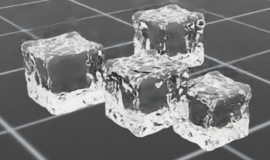

# IsaacLab_forFluid

> A fluid-simulation extension of Isaac Lab for robotics simulation and learning with fluid interactions.

**IsaacLab_forFluid** is a modified version of Isaac Lab designed to support fluid simulation workflows. It relies on custom versions of both Isaac Sim and Isaac Lab maintained under the **robegi** GitHub account.

<!-- Replace with screenshots from the fluid test task -->
<p align="center">
  
</p>

---

## Prerequisites

Before installing IsaacLab_forFluid, make sure you have:

- Ubuntu 22.04/24.04 (recommended)
- NVIDIA GPU with recent drivers - tested on RTX 4050 (below min specs, I know)
- Python 3.11
- Access to the modified repositories:
  - `robegi/isaacsim_forFluid`
  - `robegi/IsaacLab_forFluid`

---

## Installation

### 1. Install Isaac Sim for Fluid

Clone the modified Isaac Sim repository and switch to the fluid branch:

```bash
git clone https://github.com/robegi/isaacsim_forFluid.git
cd isaacsim_forFluid
git checkout fluid-mod
```

Follow the installation instructions provided in the base Isaac Sim repository. They work identically for installing the modded branch `fluid-mod`.

---

### 2. Install IsaacLab_forFluid

Clone this repository and switch to the fluid branch:

```bash
git clone https://github.com/robegi/IsaacLab_forFluid.git
cd IsaacLab_forFluid
git checkout fluid-mod
```

Install IsaacLab_forFluid following the standard Isaac Lab installation procedure, while on the `fluid-mod` branch.

---

## Verify the Installation

Run a basic task to verify that the installation completed successfully. Run:

```bash
./isaaclab.sh -p scripts/tutorials/01_assets/run_fluid_object_sampler.py 
```
This will run a simulation with several small transparent fluid cylinders spawning and falling on the ground.

This script works by using the Isaac Sim particle sampler, that samples particles from a volume provided by a basic prim. This is the main way in which the particle simulation is presented in the [PhysX docs](https://docs.omniverse.nvidia.com/kit/docs/omni_physics/latest/dev_guide/particles/particles.html). It is also present in the Isaac Sim particle fluid demo scenes, on which this code is based.

Alternatively, it is possible to spawn the fluid particles in a predefined grid, which is a procedure also included in the demo scenes. A slightly different way of defining the render material is also included here.

```bash
./isaaclab.sh -p scripts/tutorials/01_assets/run_fluid_object_grid.py
```

---

## ⚠️ Cache Compatibility Warning

Running the `fluid-mod` branch may generate cache files that are incompatible with the standard Isaac Sim setup.

If you switch back to the main branch of Isaac Sim and encounter startup or simulation issues, try and delete the Omniverse cache directory:

```bash
rm -rf ~/.local/share/ov/data
```

The cache will be rebuilt automatically during the next launch.

---
## Future work
This repo is open to anyone that want to improve the fluid simulation, waiting for the NVIDIA team to fix the current PhysX simulation issues that made this fork necessary.

The documentation and tutorials will also have additions to show how to integrate the particle simulation in an  actual RL task. The examples above however, already have all the necessary functions to train a RL agent.

---

## Repository Versions

| Repository | Branch |
|------------|---------|
| Isaac Sim for Fluid | `fluid-mod` |
| IsaacLab_forFluid | `fluid-mod` |

---

## Acknowledgement

IsaacLab_forFluid is based on the excellent work of the Isaac Lab development team.

Please refer to the original Isaac Lab project for core documentation, concepts, and upstream updates.

- Isaac Lab: https://github.com/isaac-sim/IsaacLab
- Isaac Sim: https://developer.nvidia.com/isaac/sim

---

## License

This repository inherits the licensing terms of its upstream dependencies unless otherwise specified.
